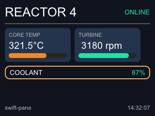

# swift-pane

[](https://jimstudt.github.io/swift-pane/documentation/swiftpane/)
[](https://github.com/jimstudt/swift-pane/actions/workflows/docs.yml)
[](https://swift.org)
[](LICENSE)

📖 **[API documentation](https://jimstudt.github.io/swift-pane/documentation/swiftpane/)** — built by CI from every push to `main`.

> [!WARNING]
> **This is extremely young software**, being put together for one
> specific use, and it will change however that use demands — the API,
> the rendering output, and the scope are all liable to shift without
> notice or deprecation. There are no releases in the "we support this"
> sense, only tags. If you want something stable to build on, **fork it**
> and take what's useful; the MIT license is your friend.

A dashboard renderer for embedded-minded Swift: an element tree in,
pixels (or a PNG) out. You describe a fixed layout of rectangles,
gauges, and single-line text as a tree of value-type elements;
SwiftPane lays it out Flutter-style (constraints down, sizes up,
parents position) and renders it into caller-owned BGRA8888 buffers —
whole-frame, or band by band for devices that can't afford a
framebuffer. Text comes from
[swift-glyph](https://github.com/jimstudt/swift-glyph), the package's
only dependency.



## Shape of the API

```swift
var temp = TextBuffer<16>()             // fixed-capacity, printf-shaped formatting
temp.append(reading, decimals: 1)
temp.append("°C")

var pane = Pane(size: Size(width: 320, height: 240), root:
    Padding(10, Column(spacing: 8,
        Row(spacing: 8, alignment: .center,
            Label("REACTOR 4", size: 26, color: .white),
            Spacer(),
            Label("ONLINE", size: 14, color: accent)),
        Box(fill: card, cornerRadius: 8, padding: EdgeInsets(8),
            Label(temp.span, size: 20, color: .white)))))

let env = Environment(fonts: fonts.span, textColor: .white)
pane.layout(env)                        // once per frame
for band in bands {                     // then any number of bands
    var canvas = Canvas(pixels: bandPixels, bandRect: band,
                        glyphScratch: scratch)
    pane.render(into: &canvas, env)
}
```

Or stream the frame as a PNG — the encoder is allocation-free
fixed-Huffman deflate whose distance-4 matches amount to run-length
encoding, so an embedded target can serve HTTP screenshots while
owning only a band buffer:

```swift
pane.renderPNG(env, background: bg,
               bandBuffer: bandBuffer, glyphScratch: scratch) { bytes in
    socket.write(bytes)
}
```

## Design notes

- **No allocation in the library.** Pixel buffers, glyph scratch
  (`Pane.glyphScratchSize` reports the exact requirement), and text
  storage are caller-owned; the tree is stack values, statically
  typed all the way down — no existentials, no ARC in the hot path.
- **Per-frame trees, enforced by the compiler.** `Label` borrows its
  text as a `UTF8Span`, making elements `~Escapable`: build, layout,
  render, discard, every frame. Layout caches live inline in the
  nodes, so banded rendering re-renders from stable state and banded
  output is byte-identical to whole-frame output.
- **Crisp by construction.** Layout runs on whole pixels; the only
  anti-aliasing is rounded corners and glyph coverage.
- **Elements**: `Label`, `Box`, `Row`/`Column` (with flex and
  `Spacer`), `Overlay`, `Padding`, `Align`, `SizedBox`, `Flexible`.
  Containers hold up to 8 children (nest for more) — a cons-list
  encoding that would become parameter packs the day Swift allows
  `~Escapable` pack elements.

## Using it

```swift
dependencies: [
    .package(url: "https://github.com/jimstudt/swift-pane.git", from: "0.1.0"),
],
```

Requires Swift 6.3+ (`InlineArray`, `Span`/`UTF8Span`, lifetime
annotations). Develops and tests on macOS; the library itself imports
nothing but SwiftGlyph and the standard library, with Embedded Swift
as the destination it is shaped for.

## Building and testing

```sh
swift build
swift test
```

The test suite includes a representative-dashboard integration test
that renders the image above, streams it through the PNG encoder in
uneven bands, and verifies it through a real decoder (ImageIO) — plus
a check that banded and whole-frame renders agree byte for byte.
